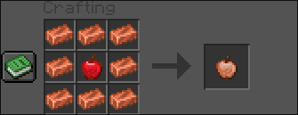
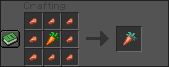
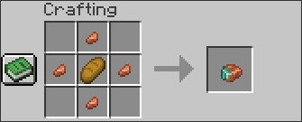
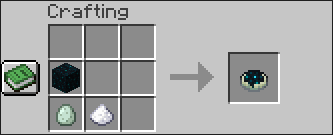

# Copper Food 🍽️
Small Fabric mod that adds new copper-based food items to Minecraft.

## 🧩 Features
- **Copper Apple** — grants *Haste (90s)* when eaten.
- **Copper Carrot** — grants *Night Vision (60s)* when eaten.
- Balanced hunger and saturation values.
- Crafted from vanilla ingredients.

## 🧪 Recipes
### Copper Apple

### Copper Carrot

### Copper Gingerbread

### Sculk Pie

---

## 🧱 Installation
1. Install **Fabric Loader** `0.17.3` and **Fabric API** (for Minecraft `1.21.9`).
2. Download the latest `copperfood-x.x.x.jar` from [Releases](https://github.com/Qu0i/CopperFood/releases).
3. Place the `.jar` in your Minecraft `mods/` folder.

---

## ⚙️ Technical Info
| Component | Version |
|------------|----------|
| Minecraft | 1.21.9 |
| Fabric Loom | 1.11 |
| Gradle | 8.14.1 |
| Java | 21 |

---

## 📄 License
MIT License - do whatever you want, but please credit `qu0i`.

---

> *Made with 🤍 by `qu0i`*
